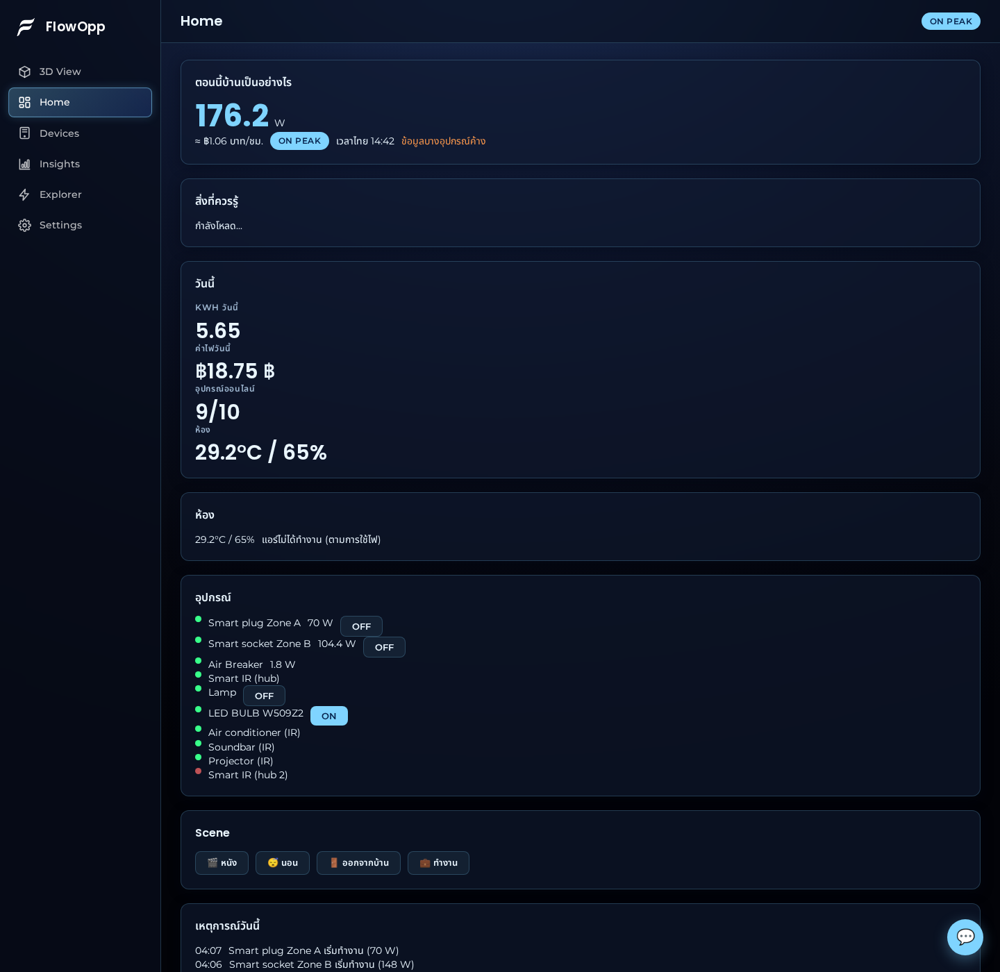

# Hi, I'm Pitchaya Hutajuta 👋

**Full-Stack Developer** · B.Sc. Computer Science (1st Class Honors, CGPA 3.93)

I build and ship real products end-to-end — from code and CI/CD to server, domain, and monitoring.

---

## 🚀 Personal Projects

### ⚡ IoT Energy Monitoring Platform

Realtime smart-home energy dashboard monitoring 10 devices.
- **Realtime pipeline**: SSE live updates · LAN polling (15s) + cloud polling (30s) → SQLite
- **Insights engine**: billing forecast, AC session detection, temperature–power correlation — all computed from real data
- **AI chatbot**: LLM tool-calling with a confirmation gate before executing device control
- **DevOps**: Docker, automated health checks, alerting
- `Python` `FastAPI` `SQLite` `Docker` `Three.js` `LLM APIs`

### 🔄 CI/CD (Home Lab)
GitLab CI with a self-hosted runner: automatic build checks on dev branches → deploy-on-merge to main with automated verification (HTTP 200 / login checks) and version tagging.

---

## 💼 Experience & Academic Projects

| Project | What it does | Stack |
|---|---|---|
| **Cloud Pricing & Cost** (TigerSoft internship) | Customizable cloud package pricing system for the Sales team — in production | React · Node.js · Express · MySQL |
| **ATS Recruitment System** (Capstone) | Full-stack recruitment platform with AI-assisted candidate evaluation | Next.js · Go · Python · PostgreSQL |
| **Hotel 999** (Freelance) | Desktop hotel management system with auto-update via GitHub Releases | Electron · React · SQLite |

---

## 🛠️ Tech Stack

**Frontend**

**Backend**

**Database & DevOps**

**Automation & AI**

---

## 🎓 Education

**B.Sc. Computer Science & Software Development Innovation** — Sripatum University (Aug 2022 – May 2026)
CGPA 3.93 · 1st Class Honors · Secretary of Fullstack Dev Club

## 🏅 Certifications

Google Data Analytics · LlamaIndex RAG Systems · Microsoft Machine Learning Concepts · Huawei AI Basics

---

<i>Thai (Native) · English (Working Proficiency)</i> 
📧 <a href="mailto:pitchaya.hut@gmail.com">pitchaya.hut@gmail.com</a>

